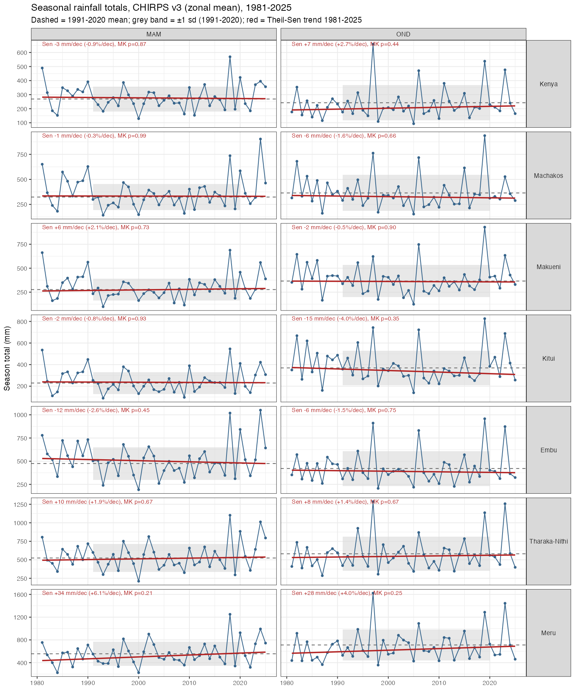
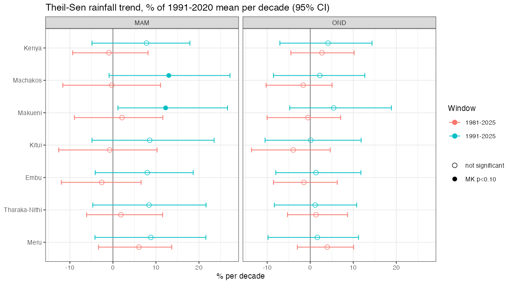
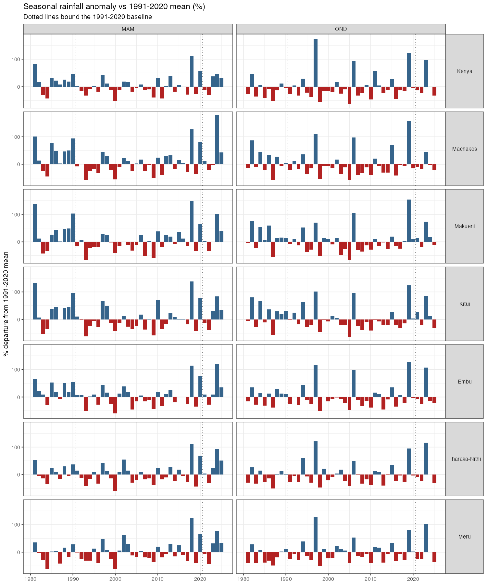

# Seasonal rainfall baseline (1991–2020) and trends (to 2025) — eastern Kenya counties

**Prepared:** 2026-09-25 · **Contact:** Pete Steward (p.steward@cgiar.org) · **Source repo:** [AdaptationAtlas/hazards_prototype](https://github.com/AdaptationAtlas/hazards_prototype)

Request: for Machakos, Makueni, Kitui, Embu, Tharaka-Nithi and Meru (plus Kenya as context), a
1991–2020 baseline and trends through 2025 in **seasonal rainfall amount** for the long rains
(MAM, March–May) and short rains (OND, October–December). Onset, cessation and season length
were out of scope.

Everything here is derived from the Africa Agriculture Adaptation Atlas observational climate
layer, which is public. Section 3 explains how to pull the same input tables yourself; section 5
links the scripts that build them.

---

## 1. Headline results

- **Full record 1981–2025: no statistically significant trend in seasonal totals** in either
  season, in any of the six counties or for Kenya as a whole (all Mann-Kendall p > 0.2). Theil-Sen
  slopes are within ±6 % of the 1991–2020 mean per decade and every 95 % confidence interval
  spans zero.
- **1991–2025: MAM shows a wetting tendency in all six counties and nationally** (+8 to +13 % of
  the baseline mean per decade). Only Makueni (p = 0.03) and Machakos (p = 0.06) reach p < 0.10.
  The signal comes from the very wet long rains of 2018, 2020, 2024 and 2025 following the dry
  1990s–2000s; it is absent over 1981–2025 because the 1980s were also wet.
- **OND shows no trend in either window** for these counties (all p > 0.2). OND totals are more
  variable than MAM (CV 0.4–0.5 vs 0.35–0.45) and are dominated by ENSO / Indian Ocean Dipole
  years: 1997, 2019 and 2023 very wet; 1998 and 2005 very dry.
- **Elsewhere in Kenya** (context, all 48 counties): the only robust wetting signal over the full
  1981–2025 record is in **OND in western Kenya** — Lake Victoria basin and north Rift counties
  (Nandi, Bungoma, Kisumu, Kericho, Elgeyo-Marakwet, Uasin Gishu, Baringo, Trans Nzoia, Kakamega,
  Vihiga, Nyamira; +7 to +12 %/decade, p < 0.05). No county shows a significant drying trend in
  either season or window.
- **Start-year sensitivity matters.** Windows beginning in the dry early 1990s look wetter than
  windows beginning in 1981. Report both windows together.





## 2. Results tables

### 2.1 Baseline 1991–2020 (30 seasons per zone)

CV = sd / mean (interannual). Min/Max are the driest and wettest seasons in the 30-year window.

|     Zone      | Season | Mean (mm) | SD (mm) |  CV  | Min (mm) | Min yr | Max (mm) | Max yr |
|---------------|--------|----------:|--------:|-----:|---------:|-------:|---------:|-------:|
| Kenya         | MAM    | 269       | 89      | 0.33 | 129      | 2000   | 569      | 2018   |
| Embu          | MAM    | 475       | 176     | 0.37 | 193      | 2000   | 1019     | 2018   |
| Kitui         | MAM    | 229       | 101     | 0.44 | 89       | 1993   | 546      | 2018   |
| Machakos      | MAM    | 324       | 128     | 0.4  | 142      | 1993   | 736      | 2018   |
| Makueni       | MAM    | 277       | 114     | 0.41 | 98       | 1993   | 688      | 2018   |
| Meru          | MAM    | 556       | 215     | 0.39 | 224      | 2000   | 1250     | 2018   |
| Tharaka-Nithi | MAM    | 524       | 190     | 0.36 | 211      | 2000   | 1102     | 2018   |
| Kenya         | OND    | 242       | 125     | 0.52 | 93       | 2005   | 659      | 1997   |
| Embu          | OND    | 421       | 188     | 0.45 | 207      | 1998   | 958      | 2019   |
| Kitui         | OND    | 370       | 160     | 0.43 | 139      | 2005   | 826      | 2019   |
| Machakos      | OND    | 364       | 180     | 0.49 | 153      | 2005   | 937      | 2019   |
| Makueni       | OND    | 366       | 167     | 0.46 | 124      | 2005   | 928      | 2019   |
| Meru          | OND    | 711       | 274     | 0.39 | 357      | 1998   | 1622     | 1997   |
| Tharaka-Nithi | OND    | 581       | 229     | 0.39 | 305      | 1998   | 1286     | 1997   |

### 2.2 Trends 1981–2025 (45 seasons)

Theil-Sen slope with 95 % CI; Mann-Kendall tau and two-sided p. `Signif.` bins p: `p<0.01`,
`p<0.05`, `p<0.10`, `ns`. Percent slopes are relative to the 1991–2020 mean.

|     Zone      | Season | 1991-2020 mean (mm) | Sen slope (mm/decade) | 95% CI (mm/decade) | Sen slope (%/decade) | MK tau | MK p  | Signif. |
|---------------|--------|--------------------:|----------------------:|--------------------|---------------------:|-------:|------:|---------|
| Kenya         | MAM    | 269                 | -3                    | -25 to 22          | -0.9                 | -0.02  | 0.868 | ns      |
| Embu          | MAM    | 475                 | -12                   | -57 to 31          | -2.6                 | -0.08  | 0.451 | ns      |
| Kitui         | MAM    | 229                 | -2                    | -29 to 24          | -0.8                 | -0.01  | 0.93  | ns      |
| Machakos      | MAM    | 324                 | -1                    | -38 to 36          | -0.3                 | -0.0   | 0.992 | ns      |
| Makueni       | MAM    | 277                 | 6                     | -25 to 32          | 2.1                  | 0.04   | 0.732 | ns      |
| Meru          | MAM    | 556                 | 34                    | -19 to 76          | 6.1                  | 0.13   | 0.214 | ns      |
| Tharaka-Nithi | MAM    | 524                 | 10                    | -32 to 61          | 1.9                  | 0.04   | 0.674 | ns      |
| Kenya         | OND    | 242                 | 7                     | -11 to 25          | 2.7                  | 0.08   | 0.44  | ns      |
| Embu          | OND    | 421                 | -6                    | -36 to 26          | -1.5                 | -0.03  | 0.747 | ns      |
| Kitui         | OND    | 370                 | -15                   | -50 to 17          | -4.0                 | -0.1   | 0.353 | ns      |
| Machakos      | OND    | 364                 | -6                    | -37 to 18          | -1.6                 | -0.05  | 0.66  | ns      |
| Makueni       | OND    | 366                 | -2                    | -37 to 26          | -0.5                 | -0.01  | 0.899 | ns      |
| Meru          | OND    | 711                 | 28                    | -21 to 72          | 4.0                  | 0.12   | 0.252 | ns      |
| Tharaka-Nithi | OND    | 581                 | 8                     | -31 to 50          | 1.4                  | 0.04   | 0.674 | ns      |

### 2.3 Trends 1991–2025 (35 seasons)

|     Zone      | Season | 1991-2020 mean (mm) | Sen slope (mm/decade) | 95% CI (mm/decade) | Sen slope (%/decade) | MK tau | MK p  | Signif. |
|---------------|--------|--------------------:|----------------------:|--------------------|---------------------:|-------:|------:|---------|
| Kenya         | MAM    | 269                 | 21                    | -13 to 48          | 7.8                  | 0.14   | 0.233 | ns      |
| Embu          | MAM    | 475                 | 38                    | -20 to 89          | 8.0                  | 0.13   | 0.268 | ns      |
| Kitui         | MAM    | 229                 | 20                    | -11 to 54          | 8.6                  | 0.15   | 0.201 | ns      |
| Machakos      | MAM    | 324                 | 42                    | -3 to 88           | 13.0                 | 0.23   | 0.057 | p<0.10  |
| Makueni       | MAM    | 277                 | 34                    | 3 to 74            | 12.3                 | 0.26   | 0.029 | p<0.05  |
| Meru          | MAM    | 556                 | 49                    | -23 to 120         | 8.8                  | 0.17   | 0.156 | ns      |
| Tharaka-Nithi | MAM    | 524                 | 44                    | -25 to 114         | 8.4                  | 0.15   | 0.201 | ns      |
| Kenya         | OND    | 242                 | 10                    | -17 to 35          | 4.1                  | 0.1    | 0.394 | ns      |
| Embu          | OND    | 421                 | 6                     | -34 to 50          | 1.3                  | 0.04   | 0.755 | ns      |
| Kitui         | OND    | 370                 | 0                     | -39 to 44          | 0.1                  | 0.01   | 0.977 | ns      |
| Machakos      | OND    | 364                 | 8                     | -31 to 46          | 2.2                  | 0.08   | 0.532 | ns      |
| Makueni       | OND    | 366                 | 20                    | -17 to 69          | 5.5                  | 0.15   | 0.201 | ns      |
| Meru          | OND    | 711                 | 12                    | -70 to 80          | 1.7                  | 0.03   | 0.82  | ns      |
| Tharaka-Nithi | OND    | 581                 | 7                     | -48 to 63          | 1.1                  | 0.03   | 0.82  | ns      |

### 2.4 All 48 counties — count of significant trends (context)

| Season |  Window   | Sig. wetter (p<0.05) | Sig. drier (p<0.05) | Not significant | Median slope (%/decade) |
|--------|-----------|---------------------:|--------------------:|----------------:|------------------------:|
| MAM    | 1981-2025 | 2                    | 0                   | 46              | 0.3                     |
| MAM    | 1991-2025 | 7                    | 0                   | 41              | 7.8                     |
| OND    | 1981-2025 | 11                   | 0                   | 37              | 4.2                     |
| OND    | 1991-2025 | 9                    | 0                   | 39              | 7.0                     |

Full per-county tables: [`data/ke_all_counties_ptot_trends.csv`](data/ke_all_counties_ptot_trends.csv),
[`data/ke_all_counties_ptot_baseline_1991_2020.csv`](data/ke_all_counties_ptot_baseline_1991_2020.csv).



### 2.5 Files in this folder

| File | Content |
|---|---|
| [`data/ke_eastern_ptot_series.csv`](data/ke_eastern_ptot_series.csv) | zone × season × year 1981–2025: seasonal total (mm), within-zone spatial sd, anomaly vs 1991–2020 (mm, %), z-score |
| [`data/ke_eastern_ptot_baseline_1991_2020.csv`](data/ke_eastern_ptot_baseline_1991_2020.csv) | zone × season: 30-yr mean, sd, CV, min/max and their years, 20th/80th percentiles |
| [`data/ke_eastern_ptot_trends.csv`](data/ke_eastern_ptot_trends.csv) | zone × season × window: Theil-Sen slope (mm/yr, mm/decade, %/decade, 95 % CI), Mann-Kendall tau and p, OLS slope and p, lag-1 residual autocorrelation |
| [`data/ke_all_counties_ptot_*.csv`](data/) | same baseline and trend tables for all 48 counties |
| [`data/kenya_ptot_seasonal_all_counties.csv`](data/kenya_ptot_seasonal_all_counties.csv) | raw extract from the S3 parquet (all 48 counties + Kenya adm0; MAM, OND, annual; 1981–2025) |
| [`figures/`](figures/) | the three PNGs shown above |

---

## 3. Input data and how to access it

### 3.1 What the input is

| Item | Detail |
|---|---|
| Rainfall product | **CHIRPS v3** monthly precipitation, UCSB Climate Hazards Center. Station-merged satellite rainfall, native 0.05° (~5.5 km) grid. Source files: <https://data.chc.ucsb.edu/products/CHIRPS/v3.0/monthly/> |
| Period | 1981-01 → 2025-12 (final release). |
| Zones | GAUL 2024 admin-1 (Kenya's 47 counties, 48 polygons) and admin-0. |
| Seasonal total | Monthly grids summed over the 3 months of the season per pixel, then the **zonal mean over all pixels in the polygon** (`value_mean`, mm). `value_sd` is the spatial sd across pixels inside the zone for that season (how uneven rain was within the county), not a temporal sd. |
| Seasons available | `annual`, `JFM`, `FMA`, `MAM`, `AMJ`, `MJJ`, `JJA`, `JAS`, `ASO`, `SON`, `OND`, `NDJ`, `DJF`. This analysis uses `MAM`, `OND` (+ `annual` for context). |
| Other variables in the same tables | `TMAX`, `TMIN`, `TAVG` (CHIRTS-ERA5, °C) and `SPEI-01/03/06/12/24`. |

### 3.2 Where it lives (public S3, anonymous read)

```
s3://digital-atlas/domain=climate/type=observational/source=chirps-chirts-era5/region=africa/processing=admin-periods/variable=adm1_obs.parquet   # counties (admin-1), all of Africa
s3://digital-atlas/domain=climate/type=observational/source=chirps-chirts-era5/region=africa/processing=admin-periods/variable=adm0_obs.parquet   # countries (admin-0)
s3://digital-atlas/domain=climate/type=observational/source=chirps-chirts-era5/region=africa/processing=admin-monthly/variable=adm1_obs.parquet   # monthly, if you want to build other seasons
```

HTTPS equivalent: replace `s3://digital-atlas/` with `https://digital-atlas.s3.amazonaws.com/`.

Schema of the `admin-periods` parquets (long format, one row per zone × year × period × variable):

|   column    |    type    |
|-------------|------------|
| iso3        | BYTE_ARRAY |
| admin0_name | BYTE_ARRAY |
| admin1_name | BYTE_ARRAY |
| admin2_name | BYTE_ARRAY |
| gaul0_code  | DOUBLE     |
| gaul1_code  | DOUBLE     |
| gaul2_code  | BOOLEAN    |
| year        | INT32      |
| period      | BYTE_ARRAY |
| variable    | BYTE_ARRAY |
| value_mean  | DOUBLE     |
| value_sd    | DOUBLE     |

**Known quirk — Kenya admin-0 has two rows per year.** `gaul0_code` 137 is mainland Kenya;
135 is the disputed Ilemi Triangle sliver (small and dry). Use 137 for national figures.
County (admin-1) rows have no such duplication.

### 3.3 Pull the exact input used here

**DuckDB CLI** (fastest; reads the parquet in place, no download):

```sql
INSTALL httpfs; LOAD httpfs; SET s3_region = 'us-east-1';
SELECT admin1_name, year, period, value_mean AS ptot_mm, value_sd AS ptot_spatial_sd_mm
FROM read_parquet('s3://digital-atlas/domain=climate/type=observational/source=chirps-chirts-era5/region=africa/processing=admin-periods/variable=adm1_obs.parquet',
                  hive_partitioning = false)
WHERE admin0_name = 'Kenya' AND variable = 'PTOT' AND period IN ('MAM', 'OND')
  AND admin1_name IN ('Machakos', 'Makueni', 'Kitui', 'Embu', 'Tharaka-Nithi', 'Meru')
ORDER BY admin1_name, period, year;
```

**R** (`duckdb` package; do not attach `arrow` in the same session):

```r
library(duckdb)
con <- dbConnect(duckdb())
dbExecute(con, "INSTALL httpfs; LOAD httpfs; SET s3_region='us-east-1';")
url <- "s3://digital-atlas/domain=climate/type=observational/source=chirps-chirts-era5/region=africa/processing=admin-periods/variable=adm1_obs.parquet"
ke <- dbGetQuery(con, sprintf("
  SELECT admin1_name, year, period, value_mean AS ptot_mm
  FROM read_parquet('%s', hive_partitioning=false)
  WHERE admin0_name='Kenya' AND variable='PTOT' AND period IN ('MAM','OND')", url))
dbDisconnect(con, shutdown = TRUE)
```

**Python** (`duckdb` package):

```python
import duckdb
con = duckdb.connect()
con.execute("INSTALL httpfs; LOAD httpfs; SET s3_region='us-east-1';")
url = "s3://digital-atlas/domain=climate/type=observational/source=chirps-chirts-era5/region=africa/processing=admin-periods/variable=adm1_obs.parquet"
ke = con.execute(f"""
  SELECT admin1_name, year, period, value_mean AS ptot_mm
  FROM read_parquet('{url}', hive_partitioning=false)
  WHERE admin0_name='Kenya' AND variable='PTOT' AND period IN ('MAM','OND')""").df()
```

Or simply use the CSV extract committed alongside this note:
[`data/kenya_ptot_seasonal_all_counties.csv`](data/kenya_ptot_seasonal_all_counties.csv).

### 3.4 Per-pixel rasters

Per-pixel climatology COGs (mean / min / max / sd over 1991–2020, 1995–2014 and the full
record, for every season, 0.05° Africa grid) are published under the same S3 root at
`processing=climatology/`. The monthly PTOT grids (one COG per month, 1981–2025) are held on the
Atlas server and can be shared on request. Layout and filename conventions are documented in
[`R/observational/README.md`](../../../R/observational/README.md); ask if you want a specific
raster located.

---

## 4. Method

- **Baseline:** 1991–2020, the WMO standard normal period. All 30 seasons present for every zone.
- **Trend:** Theil-Sen (Sen's) slope with 95 % confidence interval and the non-parametric
  Mann-Kendall test (`trend::sens.slope`, `trend::mk.test` in R), computed over two windows:
  **1981–2025** (full CHIRPS record, 45 seasons) and **1991–2025** (baseline start to present,
  35 seasons). Slopes are reported in mm per decade and as % of the 1991–2020 mean per decade.
  Ordinary least-squares slope is included in the CSV for comparison.
- **Serial correlation:** no pre-whitening applied. Lag-1 autocorrelation of the detrended
  residuals (`resid_ar1` in the trend CSV) is between −0.4 and 0 everywhere, so autocorrelation
  does not inflate the Mann-Kendall significance.
- **Anomalies** (series CSV): departure from the 1991–2020 mean in mm and %, and z-score
  (anomaly / 1991–2020 sd).

### Caveats

- CHIRPS blends satellite estimates with rain-gauge data. Gauge density in Kenya declined after
  the 1990s, so early-record values rest on more stations than recent ones.
- A county zonal mean smooths large internal gradients (Meru and Tharaka-Nithi span highland to
  semi-arid lowland). The `ptot_sd_mm` column shows how large that spread was in each season.
- 35–45 seasons is a short record for trend detection in a series with CV ≈ 0.4; the 95 % CIs on
  the slopes are about ±10 %/decade wide. Absence of significance is not evidence of no change.
- Seasonal totals say nothing about onset, cessation, dry-spell frequency or intensity, which
  can shift without the total changing.

---

## 5. Provenance — scripts that build the data

All in [AdaptationAtlas/hazards_prototype](https://github.com/AdaptationAtlas/hazards_prototype), branch `develop`.

| Step | Script | What it does |
|---|---|---|
| Overview | [`R/observational/README.md`](../../../R/observational/README.md) | Pipeline narrative, S3 layout, period and aggregation rules |
| 1 | [`R/observational/1_get_chirps_chirts.R`](../../../R/observational/1_get_chirps_chirts.R) | Downloads CHIRPS v3 monthly (and CHIRTS-ERA5 temperature) from CHC, writes one COG per month on the native 0.05° Africa grid |
| 2 | [`R/observational/2_calculate_obs_spei.R`](../../../R/observational/2_calculate_obs_spei.R) | SPEI (not used here) |
| 3 | [`R/observational/3_extract_obs_admin.R`](../../../R/observational/3_extract_obs_admin.R) | Zonal mean + sd of every monthly grid over GAUL 2024 admin-0/1 polygons → `admin-monthly` parquet |
| 4 | [`R/observational/4_aggregate_obs_admin_periods.R`](../../../R/observational/4_aggregate_obs_admin_periods.R) | Sums months into the 13 periods (PTOT = sum) → `admin-periods` parquet used here |
| 5 | [`R/observational/5_make_obs_map_climatologies.R`](../../../R/observational/5_make_obs_map_climatologies.R) | Per-pixel climatology COGs (1991–2020 etc.) |
| 6 | [`R/observational/6_publish_obs_to_s3.R`](../../../R/observational/6_publish_obs_to_s3.R) | Publishes the parquets and COGs to `s3://digital-atlas` |
| This analysis | [`R/misc/ke_eastern_rainfall_trends.R`](../../../R/misc/ke_eastern_rainfall_trends.R) | Pulls the parquet, computes the baseline, anomalies, Theil-Sen / Mann-Kendall trends and the figures in this folder. Run: `Rscript R/misc/ke_eastern_rainfall_trends.R <out_dir>` |

Boundaries: GAUL 2024 (FAO), as staged by the Atlas (`atlas_gaul24_a1_africa.parquet`).
Upstream rainfall data: Funk et al. (2015) *Sci. Data* 2:150066 (CHIRPS); v3 documentation at
<https://www.chc.ucsb.edu/data/chirps3>.
