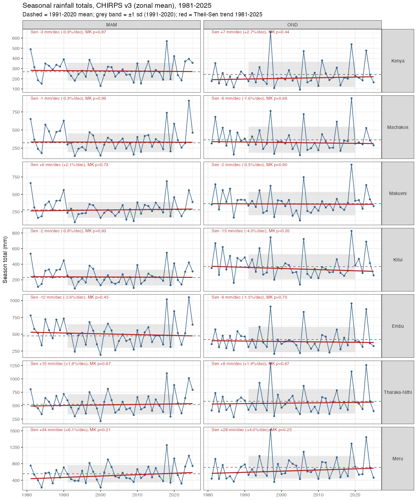
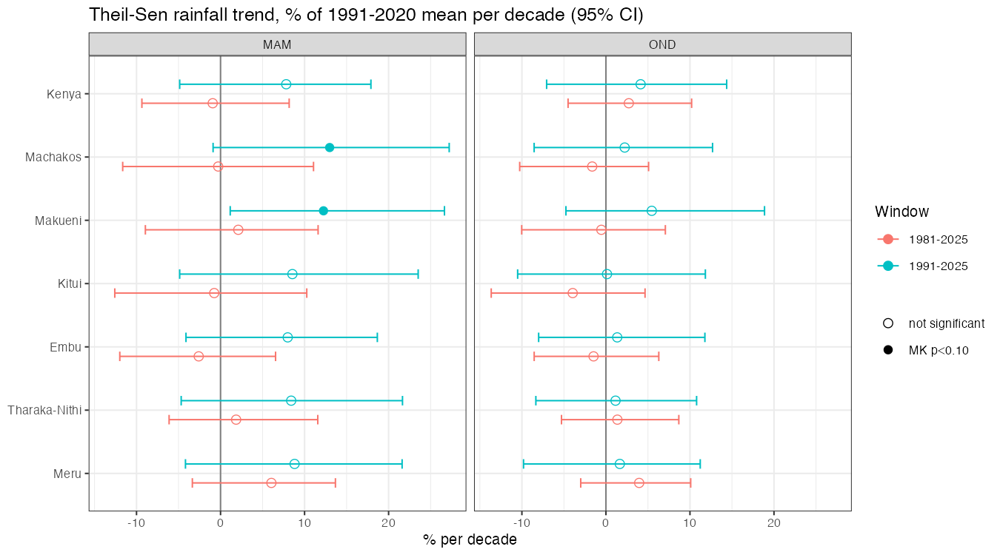
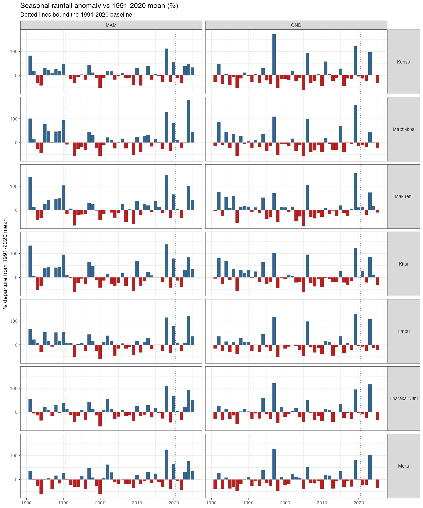
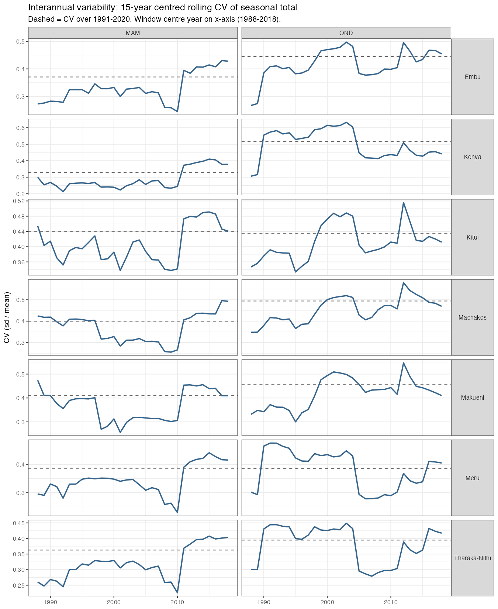
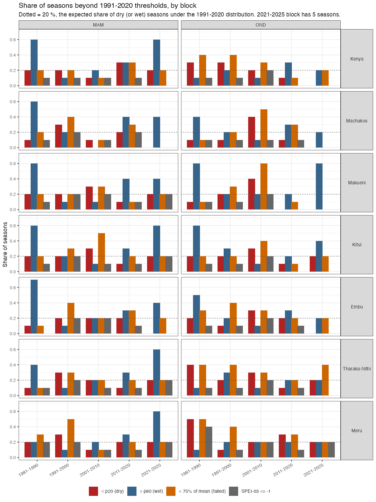
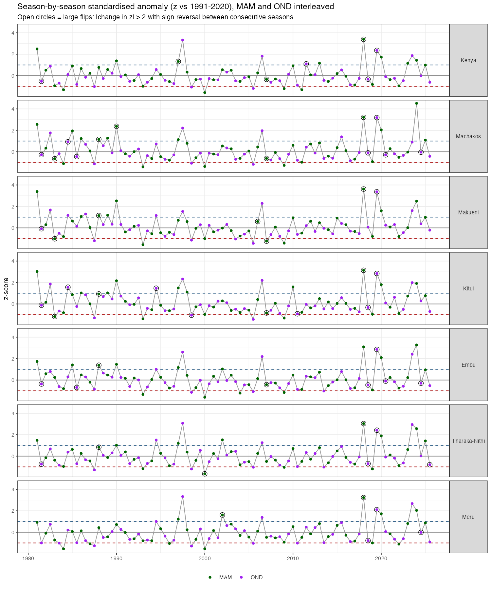

# Seasonal rainfall baseline (1991–2020) and trends (to 2025) — eastern Kenya counties

**Prepared:** 2026-09-25 · **Contact:** Pete Steward (p.steward@cgiar.org) · **Source repo:** [AdaptationAtlas/hazards_prototype](https://github.com/AdaptationAtlas/hazards_prototype)

Request: for Machakos, Makueni, Kitui, Embu, Tharaka-Nithi and Meru (plus Kenya as context), a
1991–2020 baseline and trends through 2025 in **seasonal rainfall amount** for the long rains
(MAM, March–May) and short rains (OND, October–December). Onset, cessation and season length
were out of scope.

Everything here is derived from the Africa Agriculture Adaptation Atlas observational climate
layer, which is public. Section 3 explains how to pull the same input tables yourself; section 5
links the scripts that build them. Section 6 (added 2026-09-28) covers variability and extremes.

---

## 1. Headline results

- **Full record 1981–2025: no statistically significant trend in seasonal totals** in either
  season, in any of the six counties or for Kenya as a whole (all Mann-Kendall p > 0.2). Theil-Sen
  slopes are within ±6 % of the 1991–2020 mean per decade and every 95 % confidence interval
  spans zero.
- **1991–2025: MAM shows a wetting tendency in all six counties and nationally** (+8 to +13 % of
  the baseline mean per decade). Only Makueni (p = 0.03) and Machakos (p = 0.06) reach p < 0.10.
  The signal comes from the very wet long rains of 2018, 2020, 2024 and 2025 following the dry
  1990s–2000s; it is absent over 1981–2025 because the 1980s were also wet.
- **OND shows no trend in either window** for these counties (all p > 0.2). OND totals are more
  variable than MAM (CV 0.4–0.5 vs 0.35–0.45) and are dominated by ENSO / Indian Ocean Dipole
  years: 1997, 2019 and 2023 very wet; 1998 and 2005 very dry.
- **Elsewhere in Kenya** (context, all 48 counties): the only robust wetting signal over the full
  1981–2025 record is in **OND in western Kenya** — Lake Victoria basin and north Rift counties
  (Nandi, Bungoma, Kisumu, Kericho, Elgeyo-Marakwet, Uasin Gishu, Baringo, Trans Nzoia, Kakamega,
  Vihiga, Nyamira; +7 to +12 %/decade, p < 0.05). No county shows a significant drying trend in
  either season or window.
- **Start-year sensitivity matters.** Windows beginning in the dry early 1990s look wetter than
  windows beginning in 1981. Report both windows together.





## 2. Results tables

### 2.1 Baseline 1991–2020 (30 seasons per zone)

CV = sd / mean (interannual). Min/Max are the driest and wettest seasons in the 30-year window.

|     Zone      | Season | Mean (mm) | SD (mm) |  CV  | Min (mm) | Min yr | Max (mm) | Max yr |
|---------------|--------|----------:|--------:|-----:|---------:|-------:|---------:|-------:|
| Kenya         | MAM    | 269       | 89      | 0.33 | 129      | 2000   | 569      | 2018   |
| Embu          | MAM    | 475       | 176     | 0.37 | 193      | 2000   | 1019     | 2018   |
| Kitui         | MAM    | 229       | 101     | 0.44 | 89       | 1993   | 546      | 2018   |
| Machakos      | MAM    | 324       | 128     | 0.4  | 142      | 1993   | 736      | 2018   |
| Makueni       | MAM    | 277       | 114     | 0.41 | 98       | 1993   | 688      | 2018   |
| Meru          | MAM    | 556       | 215     | 0.39 | 224      | 2000   | 1250     | 2018   |
| Tharaka-Nithi | MAM    | 524       | 190     | 0.36 | 211      | 2000   | 1102     | 2018   |
| Kenya         | OND    | 242       | 125     | 0.52 | 93       | 2005   | 659      | 1997   |
| Embu          | OND    | 421       | 188     | 0.45 | 207      | 1998   | 958      | 2019   |
| Kitui         | OND    | 370       | 160     | 0.43 | 139      | 2005   | 826      | 2019   |
| Machakos      | OND    | 364       | 180     | 0.49 | 153      | 2005   | 937      | 2019   |
| Makueni       | OND    | 366       | 167     | 0.46 | 124      | 2005   | 928      | 2019   |
| Meru          | OND    | 711       | 274     | 0.39 | 357      | 1998   | 1622     | 1997   |
| Tharaka-Nithi | OND    | 581       | 229     | 0.39 | 305      | 1998   | 1286     | 1997   |

### 2.2 Trends 1981–2025 (45 seasons)

Theil-Sen slope with 95 % CI; Mann-Kendall tau and two-sided p. `Signif.` bins p: `p<0.01`,
`p<0.05`, `p<0.10`, `ns`. Percent slopes are relative to the 1991–2020 mean.

|     Zone      | Season | 1991-2020 mean (mm) | Sen slope (mm/decade) | 95% CI (mm/decade) | Sen slope (%/decade) | MK tau | MK p  | Signif. |
|---------------|--------|--------------------:|----------------------:|--------------------|---------------------:|-------:|------:|---------|
| Kenya         | MAM    | 269                 | -3                    | -25 to 22          | -0.9                 | -0.02  | 0.868 | ns      |
| Embu          | MAM    | 475                 | -12                   | -57 to 31          | -2.6                 | -0.08  | 0.451 | ns      |
| Kitui         | MAM    | 229                 | -2                    | -29 to 24          | -0.8                 | -0.01  | 0.93  | ns      |
| Machakos      | MAM    | 324                 | -1                    | -38 to 36          | -0.3                 | -0.0   | 0.992 | ns      |
| Makueni       | MAM    | 277                 | 6                     | -25 to 32          | 2.1                  | 0.04   | 0.732 | ns      |
| Meru          | MAM    | 556                 | 34                    | -19 to 76          | 6.1                  | 0.13   | 0.214 | ns      |
| Tharaka-Nithi | MAM    | 524                 | 10                    | -32 to 61          | 1.9                  | 0.04   | 0.674 | ns      |
| Kenya         | OND    | 242                 | 7                     | -11 to 25          | 2.7                  | 0.08   | 0.44  | ns      |
| Embu          | OND    | 421                 | -6                    | -36 to 26          | -1.5                 | -0.03  | 0.747 | ns      |
| Kitui         | OND    | 370                 | -15                   | -50 to 17          | -4.0                 | -0.1   | 0.353 | ns      |
| Machakos      | OND    | 364                 | -6                    | -37 to 18          | -1.6                 | -0.05  | 0.66  | ns      |
| Makueni       | OND    | 366                 | -2                    | -37 to 26          | -0.5                 | -0.01  | 0.899 | ns      |
| Meru          | OND    | 711                 | 28                    | -21 to 72          | 4.0                  | 0.12   | 0.252 | ns      |
| Tharaka-Nithi | OND    | 581                 | 8                     | -31 to 50          | 1.4                  | 0.04   | 0.674 | ns      |

### 2.3 Trends 1991–2025 (35 seasons)

|     Zone      | Season | 1991-2020 mean (mm) | Sen slope (mm/decade) | 95% CI (mm/decade) | Sen slope (%/decade) | MK tau | MK p  | Signif. |
|---------------|--------|--------------------:|----------------------:|--------------------|---------------------:|-------:|------:|---------|
| Kenya         | MAM    | 269                 | 21                    | -13 to 48          | 7.8                  | 0.14   | 0.233 | ns      |
| Embu          | MAM    | 475                 | 38                    | -20 to 89          | 8.0                  | 0.13   | 0.268 | ns      |
| Kitui         | MAM    | 229                 | 20                    | -11 to 54          | 8.6                  | 0.15   | 0.201 | ns      |
| Machakos      | MAM    | 324                 | 42                    | -3 to 88           | 13.0                 | 0.23   | 0.057 | p<0.10  |
| Makueni       | MAM    | 277                 | 34                    | 3 to 74            | 12.3                 | 0.26   | 0.029 | p<0.05  |
| Meru          | MAM    | 556                 | 49                    | -23 to 120         | 8.8                  | 0.17   | 0.156 | ns      |
| Tharaka-Nithi | MAM    | 524                 | 44                    | -25 to 114         | 8.4                  | 0.15   | 0.201 | ns      |
| Kenya         | OND    | 242                 | 10                    | -17 to 35          | 4.1                  | 0.1    | 0.394 | ns      |
| Embu          | OND    | 421                 | 6                     | -34 to 50          | 1.3                  | 0.04   | 0.755 | ns      |
| Kitui         | OND    | 370                 | 0                     | -39 to 44          | 0.1                  | 0.01   | 0.977 | ns      |
| Machakos      | OND    | 364                 | 8                     | -31 to 46          | 2.2                  | 0.08   | 0.532 | ns      |
| Makueni       | OND    | 366                 | 20                    | -17 to 69          | 5.5                  | 0.15   | 0.201 | ns      |
| Meru          | OND    | 711                 | 12                    | -70 to 80          | 1.7                  | 0.03   | 0.82  | ns      |
| Tharaka-Nithi | OND    | 581                 | 7                     | -48 to 63          | 1.1                  | 0.03   | 0.82  | ns      |

### 2.4 All 48 counties — count of significant trends (context)

| Season |  Window   | Sig. wetter (p<0.05) | Sig. drier (p<0.05) | Not significant | Median slope (%/decade) |
|--------|-----------|---------------------:|--------------------:|----------------:|------------------------:|
| MAM    | 1981-2025 | 2                    | 0                   | 46              | 0.3                     |
| MAM    | 1991-2025 | 7                    | 0                   | 41              | 7.8                     |
| OND    | 1981-2025 | 11                   | 0                   | 37              | 4.2                     |
| OND    | 1991-2025 | 9                    | 0                   | 39              | 7.0                     |

Full per-county tables: [`data/ke_all_counties_ptot_trends.csv`](data/ke_all_counties_ptot_trends.csv),
[`data/ke_all_counties_ptot_baseline_1991_2020.csv`](data/ke_all_counties_ptot_baseline_1991_2020.csv).



### 2.5 Files in this folder

| File | Content |
|---|---|
| [`data/ke_eastern_ptot_series.csv`](data/ke_eastern_ptot_series.csv) | zone × season × year 1981–2025: seasonal total (mm), within-zone spatial sd, anomaly vs 1991–2020 (mm, %), z-score |
| [`data/ke_eastern_ptot_baseline_1991_2020.csv`](data/ke_eastern_ptot_baseline_1991_2020.csv) | zone × season: 30-yr mean, sd, CV, min/max and their years, 20th/80th percentiles |
| [`data/ke_eastern_ptot_trends.csv`](data/ke_eastern_ptot_trends.csv) | zone × season × window: Theil-Sen slope (mm/yr, mm/decade, %/decade, 95 % CI), Mann-Kendall tau and p, OLS slope and p, lag-1 residual autocorrelation |
| [`data/ke_all_counties_ptot_*.csv`](data/) | same baseline and trend tables for all 48 counties |
| [`data/kenya_ptot_seasonal_all_counties.csv`](data/kenya_ptot_seasonal_all_counties.csv) | raw extract from the S3 parquet (all 48 counties + Kenya adm0; MAM, OND, annual; 1981–2025) |
| [`figures/`](figures/) | the three PNGs shown above |

---

## 3. Input data and how to access it

### 3.1 What the input is

| Item | Detail |
|---|---|
| Rainfall product | **CHIRPS v3** monthly precipitation, UCSB Climate Hazards Center. Station-merged satellite rainfall, native 0.05° (~5.5 km) grid. Source files: <https://data.chc.ucsb.edu/products/CHIRPS/v3.0/monthly/> |
| Period | 1981-01 → 2025-12 (final release). |
| Zones | GAUL 2024 admin-1 (Kenya's 47 counties, 48 polygons) and admin-0. |
| Seasonal total | Monthly grids summed over the 3 months of the season per pixel, then the **zonal mean over all pixels in the polygon** (`value_mean`, mm). `value_sd` is the spatial sd across pixels inside the zone for that season (how uneven rain was within the county), not a temporal sd. |
| Seasons available | `annual`, `JFM`, `FMA`, `MAM`, `AMJ`, `MJJ`, `JJA`, `JAS`, `ASO`, `SON`, `OND`, `NDJ`, `DJF`. This analysis uses `MAM`, `OND` (+ `annual` for context). |
| Other variables in the same tables | `TMAX`, `TMIN`, `TAVG` (CHIRTS-ERA5, °C) and `SPEI-01/03/06/12/24`. |

### 3.2 Where it lives (public S3, anonymous read)

```
s3://digital-atlas/domain=climate/type=observational/source=chirps-chirts-era5/region=africa/processing=admin-periods/variable=adm1_obs.parquet   # counties (admin-1), all of Africa
s3://digital-atlas/domain=climate/type=observational/source=chirps-chirts-era5/region=africa/processing=admin-periods/variable=adm0_obs.parquet   # countries (admin-0)
s3://digital-atlas/domain=climate/type=observational/source=chirps-chirts-era5/region=africa/processing=admin-monthly/variable=adm1_obs.parquet   # monthly, if you want to build other seasons
```

HTTPS equivalent: replace `s3://digital-atlas/` with `https://digital-atlas.s3.amazonaws.com/`.

Schema of the `admin-periods` parquets (long format, one row per zone × year × period × variable):

|   column    |    type    |
|-------------|------------|
| iso3        | BYTE_ARRAY |
| admin0_name | BYTE_ARRAY |
| admin1_name | BYTE_ARRAY |
| admin2_name | BYTE_ARRAY |
| gaul0_code  | DOUBLE     |
| gaul1_code  | DOUBLE     |
| gaul2_code  | BOOLEAN    |
| year        | INT32      |
| period      | BYTE_ARRAY |
| variable    | BYTE_ARRAY |
| value_mean  | DOUBLE     |
| value_sd    | DOUBLE     |

**Known quirk — Kenya admin-0 has two rows per year.** `gaul0_code` 137 is mainland Kenya;
135 is the disputed Ilemi Triangle sliver (small and dry). Use 137 for national figures.
County (admin-1) rows have no such duplication.

### 3.3 Pull the exact input used here

**DuckDB CLI** (fastest; reads the parquet in place, no download):

```sql
INSTALL httpfs; LOAD httpfs; SET s3_region = 'us-east-1';
SELECT admin1_name, year, period, value_mean AS ptot_mm, value_sd AS ptot_spatial_sd_mm
FROM read_parquet('s3://digital-atlas/domain=climate/type=observational/source=chirps-chirts-era5/region=africa/processing=admin-periods/variable=adm1_obs.parquet',
                  hive_partitioning = false)
WHERE admin0_name = 'Kenya' AND variable = 'PTOT' AND period IN ('MAM', 'OND')
  AND admin1_name IN ('Machakos', 'Makueni', 'Kitui', 'Embu', 'Tharaka-Nithi', 'Meru')
ORDER BY admin1_name, period, year;
```

**R** (`duckdb` package; do not attach `arrow` in the same session):

```r
library(duckdb)
con <- dbConnect(duckdb())
dbExecute(con, "INSTALL httpfs; LOAD httpfs; SET s3_region='us-east-1';")
url <- "s3://digital-atlas/domain=climate/type=observational/source=chirps-chirts-era5/region=africa/processing=admin-periods/variable=adm1_obs.parquet"
ke <- dbGetQuery(con, sprintf("
  SELECT admin1_name, year, period, value_mean AS ptot_mm
  FROM read_parquet('%s', hive_partitioning=false)
  WHERE admin0_name='Kenya' AND variable='PTOT' AND period IN ('MAM','OND')", url))
dbDisconnect(con, shutdown = TRUE)
```

**Python** (`duckdb` package):

```python
import duckdb
con = duckdb.connect()
con.execute("INSTALL httpfs; LOAD httpfs; SET s3_region='us-east-1';")
url = "s3://digital-atlas/domain=climate/type=observational/source=chirps-chirts-era5/region=africa/processing=admin-periods/variable=adm1_obs.parquet"
ke = con.execute(f"""
  SELECT admin1_name, year, period, value_mean AS ptot_mm
  FROM read_parquet('{url}', hive_partitioning=false)
  WHERE admin0_name='Kenya' AND variable='PTOT' AND period IN ('MAM','OND')""").df()
```

Or simply use the CSV extract committed alongside this note:
[`data/kenya_ptot_seasonal_all_counties.csv`](data/kenya_ptot_seasonal_all_counties.csv).

### 3.4 Per-pixel rasters

Per-pixel climatology COGs (mean / min / max / sd over 1991–2020, 1995–2014 and the full
record, for every season, 0.05° Africa grid) are published under the same S3 root at
`processing=climatology/`. The monthly PTOT grids (one COG per month, 1981–2025) are held on the
Atlas server and can be shared on request. Layout and filename conventions are documented in
[`R/observational/README.md`](../../../R/observational/README.md); ask if you want a specific
raster located.

---

## 4. Method

- **Baseline:** 1991–2020, the WMO standard normal period. All 30 seasons present for every zone.
- **Trend:** Theil-Sen (Sen's) slope with 95 % confidence interval and the non-parametric
  Mann-Kendall test (`trend::sens.slope`, `trend::mk.test` in R), computed over two windows:
  **1981–2025** (full CHIRPS record, 45 seasons) and **1991–2025** (baseline start to present,
  35 seasons). Slopes are reported in mm per decade and as % of the 1991–2020 mean per decade.
  Ordinary least-squares slope is included in the CSV for comparison.
- **Serial correlation:** no pre-whitening applied. Lag-1 autocorrelation of the detrended
  residuals (`resid_ar1` in the trend CSV) is between −0.4 and 0 everywhere, so autocorrelation
  does not inflate the Mann-Kendall significance.
- **Anomalies** (series CSV): departure from the 1991–2020 mean in mm and %, and z-score
  (anomaly / 1991–2020 sd).

### Caveats

- CHIRPS blends satellite estimates with rain-gauge data. Gauge density in Kenya declined after
  the 1990s, so early-record values rest on more stations than recent ones.
- A county zonal mean smooths large internal gradients (Meru and Tharaka-Nithi span highland to
  semi-arid lowland). The `ptot_sd_mm` column shows how large that spread was in each season.
- 35–45 seasons is a short record for trend detection in a series with CV ≈ 0.4; the 95 % CIs on
  the slopes are about ±10 %/decade wide. Absence of significance is not evidence of no change.
- Seasonal totals say nothing about onset, cessation, dry-spell frequency or intensity, which
  can shift without the total changing.

---

## 5. Provenance — scripts that build the data

All in [AdaptationAtlas/hazards_prototype](https://github.com/AdaptationAtlas/hazards_prototype), branch `develop`.

| Step | Script | What it does |
|---|---|---|
| Overview | [`R/observational/README.md`](../../../R/observational/README.md) | Pipeline narrative, S3 layout, period and aggregation rules |
| 1 | [`R/observational/1_get_chirps_chirts.R`](../../../R/observational/1_get_chirps_chirts.R) | Downloads CHIRPS v3 monthly (and CHIRTS-ERA5 temperature) from CHC, writes one COG per month on the native 0.05° Africa grid |
| 2 | [`R/observational/2_calculate_obs_spei.R`](../../../R/observational/2_calculate_obs_spei.R) | SPEI (not used here) |
| 3 | [`R/observational/3_extract_obs_admin.R`](../../../R/observational/3_extract_obs_admin.R) | Zonal mean + sd of every monthly grid over GAUL 2024 admin-0/1 polygons → `admin-monthly` parquet |
| 4 | [`R/observational/4_aggregate_obs_admin_periods.R`](../../../R/observational/4_aggregate_obs_admin_periods.R) | Sums months into the 13 periods (PTOT = sum) → `admin-periods` parquet used here |
| 5 | [`R/observational/5_make_obs_map_climatologies.R`](../../../R/observational/5_make_obs_map_climatologies.R) | Per-pixel climatology COGs (1991–2020 etc.) |
| 6 | [`R/observational/6_publish_obs_to_s3.R`](../../../R/observational/6_publish_obs_to_s3.R) | Publishes the parquets and COGs to `s3://digital-atlas` |
| This analysis | [`R/misc/ke_eastern_rainfall_trends.R`](../../../R/misc/ke_eastern_rainfall_trends.R) | Pulls the parquet, computes the baseline, anomalies, Theil-Sen / Mann-Kendall trends and the figures in this folder. Run: `Rscript R/misc/ke_eastern_rainfall_trends.R <out_dir>` |

| Section 6 | [`R/misc/ke_eastern_rainfall_variability.R`](../../../R/misc/ke_eastern_rainfall_variability.R) | Variability, extremes and whiplash statistics and figures. Run after the trends script: `Rscript R/misc/ke_eastern_rainfall_variability.R <out_dir>` |

Boundaries: GAUL 2024 (FAO), as staged by the Atlas (`atlas_gaul24_a1_africa.parquet`).
Upstream rainfall data: Funk et al. (2015) *Sci. Data* 2:150066 (CHIRPS); v3 documentation at
<https://www.chc.ucsb.edu/data/chirps3>.

---

## 6. Variability and extremes

Added 2026-09-28. Same data, zones, seasons and 1991-2020 baseline as above. Asks whether the
*spread* and the *tails* of the seasonal-total distribution have shifted, which a trend in the
mean cannot show. Script: [`R/misc/ke_eastern_rainfall_variability.R`](../../../R/misc/ke_eastern_rainfall_variability.R).

### 6.1 Headline

- **No statistically robust change in interannual variability.** The standard deviation of
  seasonal totals is higher in 2003–2025 than in 1981–2002 in 12 of 14 zone-seasons (ratio
  1.0–1.34), but a Brown-Forsythe test on detrended residuals is non-significant everywhere
  (p > 0.4), and there is no monotonic trend in the size of departures from trend (all MK p > 0.1).
  The rolling-CV jump visible after about 2010 in MAM is produced by a handful of extreme wet
  seasons (2018, 2020, 2024), not by a broad widening of the distribution.
- **No change in the frequency of dry, failed or drought seasons.** Seasons below the 1991–2020
  20th percentile occur at close to the expected 1-in-5 rate in every block, and logistic trends
  in dry, failed (< 75 % of mean) and SPEI-03 ≤ −1 seasons are all non-significant (p > 0.1).
- **Wet extremes have clustered recently in MAM.** In 2011–2025, 30–60 % of long-rains seasons in
  these counties exceeded the baseline 80th percentile (expected 20 %), the same signal that
  produces the 1991–2025 MAM wetting trend in section 2.3. OND wet extremes show no such shift.
- **Whiplash.** Large season-to-season reversals (|Δz| > 2 with sign change) are more frequent
  in 2003–2025 than 1981–2002 in five of seven zones (e.g. Kenya 2 → 5, Embu 3 → 5, Meru 1 → 4),
  but the mean absolute season-to-season swing shows no significant trend. The 2018–2020
  sequence (record MAM 2018, dry MAM 2019, record OND 2019) is the clearest example.
- **The 2020–2022 Horn of Africa drought is muted in these counties' CHIRPS totals.** In Kitui,
  Makueni and Machakos only MAM 2022 falls below the 20th percentile; OND 2020, MAM 2021, OND 2021
  and OND 2022 are near or above the 1991–2020 median in CHIRPS v3 (table 6.6). The five-season
  failure narrative applies to the northern and north-eastern ASAL counties, not the eastern
  midlands; and seasonal totals can hide late onset and long dry spells within a season. This is
  the point where daily-resolution indices (onset, dry-spell length) are needed rather than totals.



### 6.2 Variability: halves comparison and trend in |residual|

Residuals are from a Theil-Sen fit over 1981–2025, so a trend in the mean cannot register as a
variance change. Brown-Forsythe = one-way ANOVA on |residual − group median| for 1981–2002 vs
2003–2025. The last two columns are the Theil-Sen slope of |residual| vs year (as % of the
1991–2020 SD per decade) and its Mann-Kendall p.

|     Zone      | Season | SD 1981-2002 (mm) | SD 2003-2025 (mm) | CV 1981-2002 | CV 2003-2025 | SD ratio | Brown-Forsythe p | \|resid\| trend (% of SD / decade) | MK p |
|---------------|--------|------------------:|------------------:|-------------:|-------------:|---------:|-----------------:|-----------------------------------:|-----:|
| Kenya         | MAM    | 85                | 98                | 0.3          | 0.34         | 1.16     | 0.63             | 4.6                                | 0.48 |
| Embu          | MAM    | 159               | 212               | 0.3          | 0.42         | 1.33     | 0.44             | 4.0                                | 0.55 |
| Kitui         | MAM    | 111               | 111               | 0.43         | 0.46         | 1.01     | 0.95             | -0.6                               | 0.9  |
| Machakos      | MAM    | 149               | 173               | 0.41         | 0.47         | 1.17     | 0.84             | -5.7                               | 0.38 |
| Makueni       | MAM    | 131               | 132               | 0.43         | 0.43         | 1.01     | 0.92             | -3.2                               | 0.67 |
| Meru          | MAM    | 182               | 229               | 0.35         | 0.38         | 1.26     | 0.67             | 6.1                                | 0.35 |
| Tharaka-Nithi | MAM    | 161               | 216               | 0.3          | 0.38         | 1.34     | 0.41             | 9.2                                | 0.1  |
| Kenya         | OND    | 114               | 116               | 0.5          | 0.47         | 1.01     | 0.78             | -1.1                               | 0.7  |
| Embu          | OND    | 151               | 200               | 0.36         | 0.47         | 1.33     | 0.61             | -3.3                               | 0.41 |
| Kitui         | OND    | 150               | 168               | 0.37         | 0.46         | 1.12     | 0.88             | -6.2                               | 0.3  |
| Machakos      | OND    | 146               | 182               | 0.38         | 0.5          | 1.24     | 0.81             | -3.7                               | 0.39 |
| Makueni       | OND    | 134               | 180               | 0.34         | 0.48         | 1.34     | 0.67             | -2.7                               | 0.48 |
| Meru          | OND    | 280               | 269               | 0.42         | 0.38         | 0.96     | 0.91             | 0.6                                | 0.91 |
| Tharaka-Nithi | OND    | 221               | 237               | 0.39         | 0.4          | 1.07     | 0.82             | -1.1                               | 0.79 |

### 6.3 Extremes: frequency of dry and wet seasons

Thresholds fixed from the 1991–2020 distribution, so 20 % of seasons are expected in each tail.
Odds ratio per decade is from a logistic regression of the indicator on year (1981–2025).

|     Zone      | Season | Indicator | Events (of 45) | Rate 1981-2002 | Rate 2003-2025 | Odds ratio / decade |  p   |
|---------------|--------|-----------|---------------:|---------------:|---------------:|--------------------:|-----:|
| Kenya         | MAM    | dry       | 9              | 0.18           | 0.22           | 1.1                 | 0.75 |
| Embu          | MAM    | dry       | 7              | 0.14           | 0.17           | 0.99                | 0.97 |
| Kitui         | MAM    | dry       | 9              | 0.18           | 0.22           | 0.95                | 0.86 |
| Machakos      | MAM    | dry       | 7              | 0.18           | 0.13           | 0.91                | 0.78 |
| Makueni       | MAM    | dry       | 9              | 0.18           | 0.22           | 0.95                | 0.86 |
| Meru          | MAM    | dry       | 9              | 0.23           | 0.17           | 1.0                 | 1.0  |
| Tharaka-Nithi | MAM    | dry       | 8              | 0.18           | 0.17           | 1.03                | 0.93 |
| Kenya         | MAM    | wet       | 15             | 0.36           | 0.3            | 1.04                | 0.88 |
| Embu          | MAM    | wet       | 15             | 0.41           | 0.26           | 0.81                | 0.4  |
| Kitui         | MAM    | wet       | 15             | 0.36           | 0.3            | 1.01                | 0.96 |
| Machakos      | MAM    | wet       | 14             | 0.36           | 0.26           | 0.91                | 0.69 |
| Makueni       | MAM    | wet       | 14             | 0.32           | 0.3            | 0.99                | 0.96 |
| Meru          | MAM    | wet       | 11             | 0.18           | 0.3            | 1.61                | 0.1  |
| Tharaka-Nithi | MAM    | wet       | 13             | 0.27           | 0.3            | 1.27                | 0.35 |
| Kenya         | OND    | dry       | 9              | 0.27           | 0.13           | 0.62                | 0.13 |
| Embu          | OND    | dry       | 8              | 0.14           | 0.22           | 0.98                | 0.95 |
| Kitui         | OND    | dry       | 9              | 0.18           | 0.22           | 1.01                | 0.98 |
| Machakos      | OND    | dry       | 7              | 0.09           | 0.22           | 1.05                | 0.87 |
| Makueni       | OND    | dry       | 7              | 0.14           | 0.17           | 0.83                | 0.57 |
| Meru          | OND    | dry       | 12             | 0.27           | 0.26           | 0.82                | 0.45 |
| Tharaka-Nithi | OND    | dry       | 11             | 0.27           | 0.22           | 0.74                | 0.27 |
| Kenya         | OND    | wet       | 8              | 0.14           | 0.22           | 1.23                | 0.49 |
| Embu          | OND    | wet       | 12             | 0.32           | 0.22           | 0.75                | 0.28 |
| Kitui         | OND    | wet       | 14             | 0.41           | 0.22           | 0.7                 | 0.17 |
| Machakos      | OND    | wet       | 11             | 0.27           | 0.22           | 0.82                | 0.46 |
| Makueni       | OND    | wet       | 15             | 0.41           | 0.26           | 0.86                | 0.54 |
| Meru          | OND    | wet       | 8              | 0.18           | 0.17           | 1.14                | 0.67 |
| Tharaka-Nithi | OND    | wet       | 8              | 0.18           | 0.17           | 1.1                 | 0.74 |

Failed (< 75 % of mean) and drought (SPEI-03 ≤ −1 at season end) indicators are in
[`data/ke_eastern_ptot_extremes_trend.csv`](data/ke_eastern_ptot_extremes_trend.csv); none is
significant.



### 6.4 Extremes by block (Kenya and the three lower-eastern counties)

Full table for all seven zones in [`data/ke_eastern_ptot_extremes_by_block.csv`](data/ke_eastern_ptot_extremes_by_block.csv).

|   Zone   | Season |   Block   | Seasons | Dry (<p20) | Wet (>p80) | Failed (<75%) | SPEI-03 <= -1 | Expected dry or wet |
|----------|--------|-----------|--------:|-----------:|-----------:|--------------:|--------------:|--------------------:|
| Kenya    | MAM    | 1981-1990 | 10      | 2          | 6          | 2             | 1             | 2                   |
| Kenya    | MAM    | 1991-2000 | 10      | 2          | 1          | 2             | 1             | 2                   |
| Kenya    | MAM    | 2001-2010 | 10      | 1          | 2          | 1             | 1             | 2                   |
| Kenya    | MAM    | 2011-2020 | 10      | 3          | 3          | 3             | 1             | 2                   |
| Kenya    | MAM    | 2021-2025 | 5       | 1          | 3          | 1             | 0             | 1                   |
| Kenya    | OND    | 1981-1990 | 10      | 3          | 1          | 4             | 1             | 2                   |
| Kenya    | OND    | 1991-2000 | 10      | 3          | 2          | 4             | 1             | 2                   |
| Kenya    | OND    | 2001-2010 | 10      | 2          | 1          | 3             | 2             | 2                   |
| Kenya    | OND    | 2011-2020 | 10      | 1          | 3          | 1             | 0             | 2                   |
| Kenya    | OND    | 2021-2025 | 5       | 0          | 1          | 1             | 0             | 1                   |
| Kitui    | MAM    | 1981-1990 | 10      | 2          | 6          | 2             | 1             | 2                   |
| Kitui    | MAM    | 1991-2000 | 10      | 2          | 2          | 3             | 2             | 2                   |
| Kitui    | MAM    | 2001-2010 | 10      | 3          | 1          | 5             | 1             | 2                   |
| Kitui    | MAM    | 2011-2020 | 10      | 1          | 3          | 2             | 1             | 2                   |
| Kitui    | MAM    | 2021-2025 | 5       | 1          | 3          | 1             | 1             | 1                   |
| Kitui    | OND    | 1981-1990 | 10      | 2          | 6          | 2             | 1             | 2                   |
| Kitui    | OND    | 1991-2000 | 10      | 2          | 3          | 2             | 1             | 2                   |
| Kitui    | OND    | 2001-2010 | 10      | 3          | 1          | 4             | 2             | 2                   |
| Kitui    | OND    | 2011-2020 | 10      | 1          | 2          | 1             | 0             | 2                   |
| Kitui    | OND    | 2021-2025 | 5       | 1          | 2          | 1             | 0             | 1                   |
| Machakos | MAM    | 1981-1990 | 10      | 1          | 6          | 2             | 1             | 2                   |
| Machakos | MAM    | 1991-2000 | 10      | 3          | 2          | 4             | 2             | 2                   |
| Machakos | MAM    | 2001-2010 | 10      | 1          | 0          | 1             | 1             | 2                   |
| Machakos | MAM    | 2011-2020 | 10      | 2          | 4          | 3             | 2             | 2                   |
| Machakos | MAM    | 2021-2025 | 5       | 0          | 2          | 0             | 0             | 1                   |
| Machakos | OND    | 1981-1990 | 10      | 1          | 4          | 1             | 1             | 2                   |
| Machakos | OND    | 1991-2000 | 10      | 1          | 2          | 2             | 1             | 2                   |
| Machakos | OND    | 2001-2010 | 10      | 4          | 1          | 5             | 1             | 2                   |
| Machakos | OND    | 2011-2020 | 10      | 1          | 3          | 3             | 1             | 2                   |
| Machakos | OND    | 2021-2025 | 5       | 0          | 1          | 0             | 0             | 1                   |
| Makueni  | MAM    | 1981-1990 | 10      | 2          | 6          | 2             | 1             | 2                   |
| Makueni  | MAM    | 1991-2000 | 10      | 2          | 1          | 2             | 2             | 2                   |
| Makueni  | MAM    | 2001-2010 | 10      | 3          | 1          | 3             | 2             | 2                   |
| Makueni  | MAM    | 2011-2020 | 10      | 1          | 4          | 1             | 1             | 2                   |
| Makueni  | MAM    | 2021-2025 | 5       | 1          | 2          | 1             | 1             | 1                   |
| Makueni  | OND    | 1981-1990 | 10      | 1          | 6          | 1             | 1             | 2                   |
| Makueni  | OND    | 1991-2000 | 10      | 2          | 2          | 3             | 1             | 2                   |
| Makueni  | OND    | 2001-2010 | 10      | 4          | 2          | 6             | 2             | 2                   |
| Makueni  | OND    | 2011-2020 | 10      | 0          | 2          | 1             | 0             | 2                   |
| Makueni  | OND    | 2021-2025 | 5       | 0          | 3          | 0             | 0             | 1                   |

### 6.5 Whiplash: season-to-season swings

Seasons ordered chronologically (MAM, OND, MAM, …). Swing = z(t) − z(t−1). "Big flip" = |swing| > 2
with a sign reversal.

|     Zone      | Mean \|swing\| 1981-2002 | Mean \|swing\| 2003-2025 | MK p (trend in \|swing\|) | Big flips 1981-2002 | Big flips 2003-2025 |
|---------------|-------------------------:|-------------------------:|--------------------------:|--------------------:|--------------------:|
| Kenya         | 0.93                     | 0.98                     | 0.82                      | 2                   | 5                   |
| Embu          | 0.91                     | 1.02                     | 0.56                      | 3                   | 5                   |
| Kitui         | 0.97                     | 1.03                     | 0.99                      | 6                   | 5                   |
| Machakos      | 1.07                     | 1.16                     | 0.67                      | 6                   | 6                   |
| Makueni       | 1.01                     | 1.06                     | 0.52                      | 3                   | 4                   |
| Meru          | 0.92                     | 0.94                     | 0.57                      | 1                   | 4                   |
| Tharaka-Nithi | 0.97                     | 0.99                     | 0.5                       | 3                   | 4                   |



### 6.6 The 2020–2023 seasons in the lower-eastern counties

|   Zone   | Season | Year | Total (mm) |   z   | SPEI-03 | Dry (<p20) |
|----------|--------|-----:|-----------:|------:|--------:|------------|
| Kitui    | MAM    | 2020 | 411        | 1.8   | 1.45    |            |
| Kitui    | OND    | 2020 | 384        | 0.09  | 0.2     |            |
| Kitui    | MAM    | 2021 | 199        | -0.31 | -0.43   |            |
| Kitui    | OND    | 2021 | 469        | 0.62  | 0.71    |            |
| Kitui    | MAM    | 2022 | 141        | -0.88 | -1.21   | yes        |
| Kitui    | OND    | 2022 | 289        | -0.5  | -0.35   |            |
| Kitui    | MAM    | 2023 | 304        | 0.74  | 0.82    |            |
| Kitui    | OND    | 2023 | 688        | 1.99  | 1.58    |            |
| Machakos | MAM    | 2020 | 585        | 2.04  | 1.67    |            |
| Machakos | OND    | 2020 | 312        | -0.29 | -0.29   |            |
| Machakos | MAM    | 2021 | 361        | 0.29  | 0.3     |            |
| Machakos | OND    | 2021 | 330        | -0.19 | -0.02   |            |
| Machakos | MAM    | 2022 | 258        | -0.51 | -0.78   |            |
| Machakos | OND    | 2022 | 303        | -0.34 | -0.18   |            |
| Machakos | MAM    | 2023 | 320        | -0.03 | 0.13    |            |
| Machakos | OND    | 2023 | 527        | 0.91  | 1.08    |            |
| Makueni  | MAM    | 2020 | 458        | 1.59  | 1.43    |            |
| Makueni  | OND    | 2020 | 407        | 0.25  | 0.37    |            |
| Makueni  | MAM    | 2021 | 286        | 0.08  | -0.18   |            |
| Makueni  | OND    | 2021 | 417        | 0.31  | 0.38    |            |
| Makueni  | MAM    | 2022 | 185        | -0.81 | -1.18   | yes        |
| Makueni  | OND    | 2022 | 292        | -0.44 | -0.34   |            |
| Makueni  | MAM    | 2023 | 279        | 0.02  | 0.11    |            |
| Makueni  | OND    | 2023 | 634        | 1.6   | 1.46    |            |

### 6.7 Files added

| File | Content |
|---|---|
| [`data/ke_eastern_ptot_season_flags.csv`](data/ke_eastern_ptot_season_flags.csv) | every zone × season × year with z-score, SPEI-03 at season end and dry / wet / failed / drought flags |
| [`data/ke_eastern_ptot_rolling15_variability.csv`](data/ke_eastern_ptot_rolling15_variability.csv) | 15-year centred rolling mean, sd, CV |
| [`data/ke_eastern_ptot_variability_tests.csv`](data/ke_eastern_ptot_variability_tests.csv) | table 6.2 in full |
| [`data/ke_eastern_ptot_extremes_by_block.csv`](data/ke_eastern_ptot_extremes_by_block.csv), [`data/ke_eastern_ptot_extremes_trend.csv`](data/ke_eastern_ptot_extremes_trend.csv) | tables 6.3 / 6.4 in full |
| [`data/ke_eastern_ptot_whiplash.csv`](data/ke_eastern_ptot_whiplash.csv), [`data/ke_eastern_ptot_dry_runs.csv`](data/ke_eastern_ptot_dry_runs.csv) | swing statistics; runs of ≥ 3 consecutive dry seasons (only 1983–84 and 1986–87 qualify) |
| [`data/ke_all_counties_ptot_variability_tests.csv`](data/ke_all_counties_ptot_variability_tests.csv), [`data/ke_all_counties_ptot_extremes_trend.csv`](data/ke_all_counties_ptot_extremes_trend.csv) | same for all 48 counties |
| [`data/kenya_spei03_season_end.csv`](data/kenya_spei03_season_end.csv) | SPEI-03 zonal mean at May and December, all counties + Kenya, from the `admin-monthly` parquet |

SPEI-03 extract (DuckDB):

```sql
INSTALL httpfs; LOAD httpfs; SET s3_region = 'us-east-1';
SELECT admin1_name, year, CASE month WHEN 5 THEN 'MAM' WHEN 12 THEN 'OND' END AS period, value_mean AS spei03
FROM read_parquet('s3://digital-atlas/domain=climate/type=observational/source=chirps-chirts-era5/region=africa/processing=admin-monthly/variable=adm1_obs.parquet',
                  hive_partitioning = false)
WHERE admin0_name = 'Kenya' AND variable = 'SPEI-03' AND month IN (5, 12);
```

Note that a zonal *mean* of a standardised index is damped relative to pixel values (SPEI-03 of
−1 averaged over a county is a widespread moderate drought), and the SPEI here uses Hargreaves
PET from CHIRTS temperature, fitted on 1991–2020.

### Caveats specific to this section

- 45 seasons split into two halves of 22–23 gives little power to detect a variance change of
  less than about 50 %; the sd ratios of 1.2–1.3 seen here are within what sampling alone produces.
- Threshold counts in the 2021–2025 block rest on five seasons.
- Everything here is about seasonal totals. Intensity, wet-day frequency, dry-spell length and
  onset timing need daily data (CHIRPS v3 daily or pentads) and are not covered.
